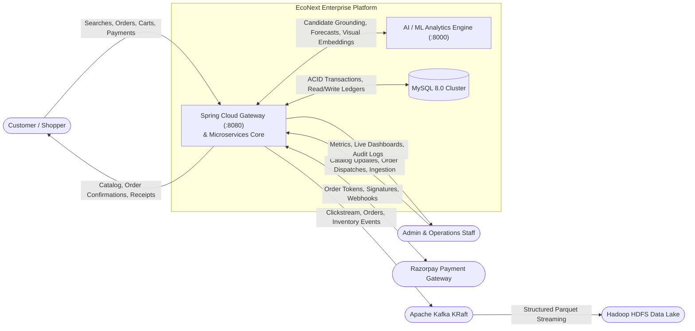
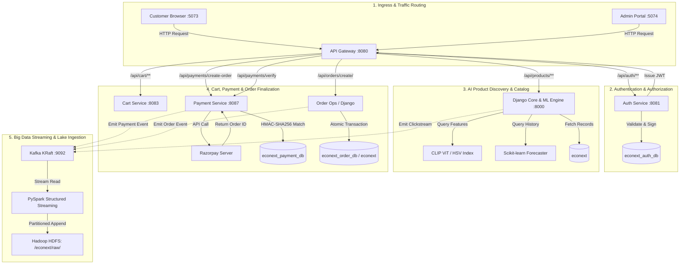
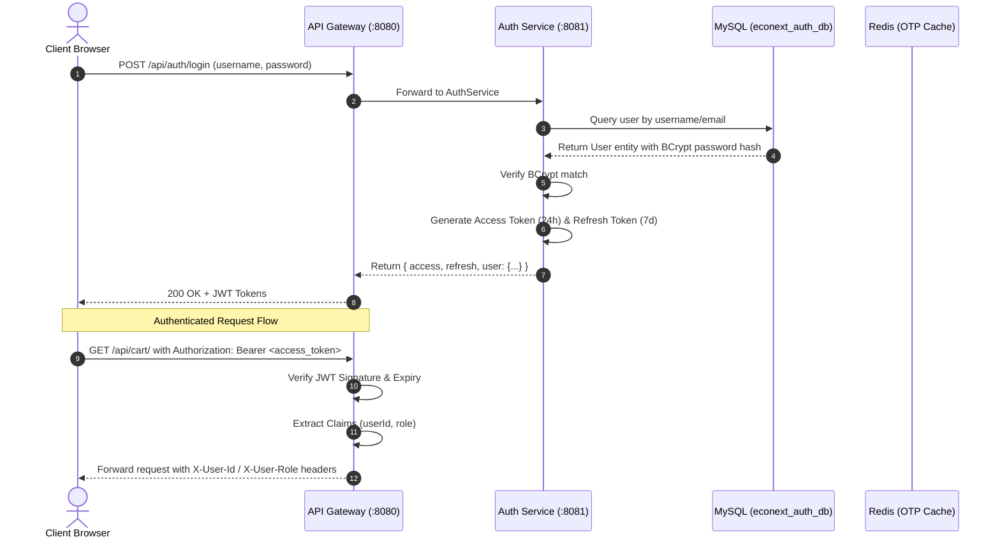
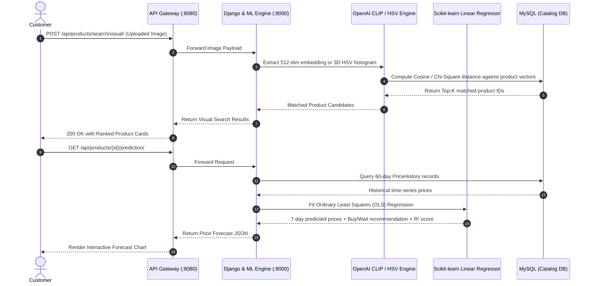
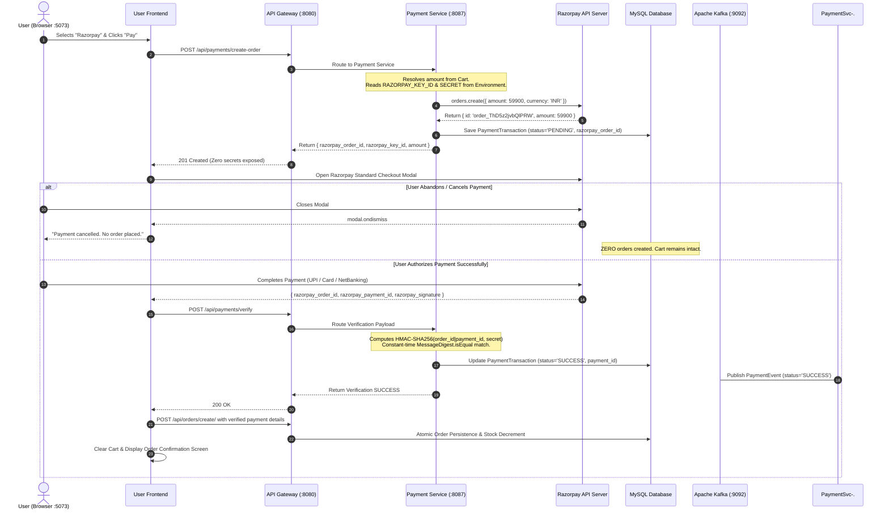
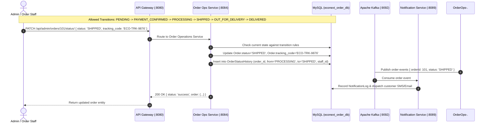
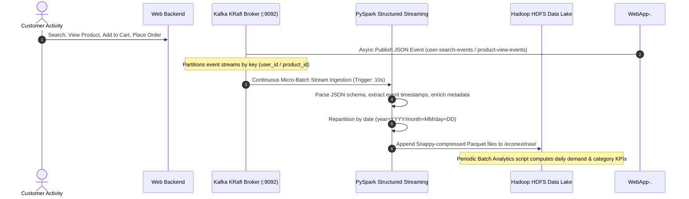
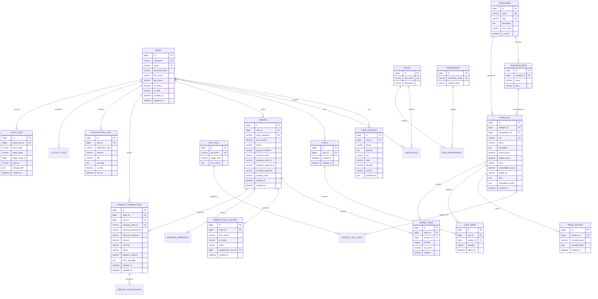

# EcoNext — AI-Integrated E-Commerce, Spring Boot Microservices & Big Data Platform

[](https://www.oracle.com/java/)
[](https://spring.io/projects/spring-boot)
[](https://spring.io/projects/spring-cloud)
[](https://www.python.org/)
[](https://www.djangoproject.com/)
[](https://www.django-rest-framework.org/)
[](https://react.dev/)
[](https://vitejs.dev/)
[](https://www.mysql.com/)
[](https://redis.io/)
[](https://kafka.apache.org/)
[](https://spark.apache.org/)
[](https://hadoop.apache.org/)
[](https://razorpay.com/)
[-success.svg)]()
[](https://opensource.org/licenses/MIT)

---

## 📌 Project Overview & Context

**EcoNext** is an enterprise-grade, sustainable AI-integrated retail platform and distributed e-commerce ecosystem developed as a **Final-Year Group Capstone Project**.

The platform combines multi-modal artificial intelligence (computer vision similarity search, predictive price forecasting, TF-IDF natural language intent search, and LLM-grounded conversational commerce) with a high-throughput **Java 21 / Spring Boot 3.3.4 microservices architecture**, a **Spring Cloud API Gateway**, a dedicated **React 19 Admin & Staff Operations Portal**, a secure **Razorpay Online Payment & Webhook Gateway**, and an event-driven **Big Data streaming & Hadoop HDFS Data Lake** ingestion layer.

### 👥 Capstone Project Team Members
* **Shiva Jinkalker** ([GitHub: @Jinkalkershiva](https://github.com/Jinkalkershiva))
* **RajputAtul75** ([GitHub: @RajputAtul75](https://github.com/RajputAtul75))

---

## 📑 Table of Contents

1. [Executive Summary & Problem Statement](#1-executive-summary--problem-statement)
2. [Project Objectives & Scope](#2-project-objectives--scope)
3. [System Design & Architectural Blueprint](#3-system-design--architectural-blueprint)
4. [Technology Stack Matrix](#4-technology-stack-matrix)
5. [Comprehensive Data Flow Diagrams (DFD)](#5-comprehensive-data-flow-diagrams-dfd)
6. [Detailed Sequence Diagrams](#6-detailed-sequence-diagrams)
7. [Database Management System (DBMS) & Entity-Relationship (ER) Design](#7-database-management-system-dbms--entity-relationship-er-design)
8. [Core Microservices & Bounded Contexts](#8-core-microservices--bounded-contexts)
9. [Razorpay Payment Gateway & Cryptographic Integrity](#9-razorpay-payment-gateway--cryptographic-integrity)
10. [AI & Machine Learning Engineering](#10-ai--machine-learning-engineering)
11. [Big Data Streaming & Hadoop HDFS Data Lake](#11-big-data-streaming--hadoop-hdfs-data-lake)
12. [Admin & Staff Operational Governance (RBAC/PBAC)](#12-admin--staff-operational-governance-rbacpbac)
13. [Customer Storefront Experience](#13-customer-storefront-experience)
14. [API Route Matrix & Gateway Ingress Mapping](#14-api-route-matrix--gateway-ingress-mapping)
15. [Group Contributions & Git Engineering History](#15-group-contributions--git-engineering-history)
16. [Local Development Setup Guide](#16-local-development-setup-guide)
17. [Verification, Quality Assurance & Test Suites](#17-verification-quality-assurance--test-suites)
18. [Planned Enhancements & Future Scope](#18-planned-enhancements--future-scope)
19. [License & Acknowledgments](#19-license--acknowledgments)

---

## 1. Executive Summary & Problem Statement

### 1.1 The Real-World Problem
Traditional e-commerce platforms suffer from critical structural, architectural, and usability bottlenecks:
1. **Rigid Keyword-Based Search**: Customers often search with lifestyle intents (e.g., *"beach vacation"*, *"home office setup"*, *"marathon training"*) rather than exact SKU names. Traditional exact-match SQL search fails on semantic phrasing.
2. **Visual Discovery Barrier**: Users frequently have a photo or screenshot of a product they admire but lack the vocabulary to describe it textually.
3. **Price Volatility & Buyer Hesitation**: E-commerce prices fluctuate dynamically. Shoppers experience hesitation and buyer remorse, wondering whether to purchase immediately or wait for an impending price drop.
4. **Lack of Sustainability Visibility**: Modern eco-conscious consumers struggle to identify environmentally responsible products, organic materials, and carbon-conscious supply chains due to greenwashing and missing standardized sustainability metrics.
5. **Premature Payment & Order State Inconsistencies**: Flawed checkout gateways create unconfirmed orders before online payment capture, leaving pending ghost orders and depleted stock when customers abandon payment modals.
6. **Monolithic Bottlenecks & Operational Opacity**: Tightly coupled monoliths present single points of failure, lack granular role-based operational security for administrative staff, and obscure the multi-stage lifecycle of order fulfillment.
7. **Telemetry & Clickstream Data Silos**: Customer behavior, search drop-offs, and conversion analytics are often lost or siloed in relational databases rather than ingested in real time into analytical data lakes for predictive intelligence.

### 1.2 How EcoNext Addresses the Problem

| Identified Problem | EcoNext Technical Solution |
| :--- | :--- |
| **Semantic Search Friction** | TF-IDF vector space semantic matching with cosine similarity |
| **Image-Based Product Discovery** | Multi-Modal Visual Search (OpenAI CLIP ViT + 3D HSV Fallback) |
| **Dynamic Price Uncertainty** | Scikit-learn Linear Regression "Buy or Wait" 7-day predictor |
| **Sustainable Retail Transparency** | Quantitative Sustainability Scores & EcoTag filtering |
| **Conversational Shopping Assistance** | Context-Grounded Google Gemini AI Copilot (Zero hallucinations) |
| **Premature Checkout Order Bug** | Cryptographic HMAC-SHA256 Razorpay verification + zero ghost orders |
| **Scalability & Domain Isolation** | Java 21 Spring Boot Microservices + Spring Cloud Gateway |
| **Distributed Order Synchronization** | Asynchronous event streaming & unified MySQL persistence |
| **Staff Governance & Auditing** | Granular RBAC/PBAC Admin Portal with forensic audit logging |
| **Real-Time Big Data Telemetry** | Apache Kafka KRaft + PySpark Streaming + Hadoop HDFS Data Lake |

---

## 2. Project Objectives & Scope

The primary engineering objectives of this final-year capstone project are:
* **Deliver Intelligent Product Discovery**: Implement multi-modal AI search allowing customers to query using images (CLIP ViT-B/32 & color histograms) or natural language intents (TF-IDF vectorizer).
* **Provide Algorithmic Shopping Intelligence**: Build an interpretable 60-day historical price forecasting engine projecting 7-day price trajectories with explicit "Buy Now" or "Wait" recommendation confidence scores.
* **Integrate Guardrailed Generative AI**: Deploy a context-grounded shopping chatbot assistant using Google Gemini, grounded strictly on real database inventory to eliminate hallucinations.
* **Guarantee Payment & Fulfillment Integrity**: Implement a secure Razorpay online payment flow with server-side amount calculation, cryptographic HMAC-SHA256 signature verification, and zero ghost-order creation.
* **Architect a Scalable Microservices Ecosystem**: Decouple business domains into independent Spring Boot microservices with Spring Cloud Gateway routing, stateless JWT security, and domain-owned MySQL database clusters.
* **Implement Role-Based Governance (RBAC/PBAC)**: Develop a secure, colorful operational administration portal enabling fine-grained access control across catalog managers, inventory handlers, order dispatchers, and analysts.
* **Construct a Big Data Streaming Pipeline**: Stream real-time telemetry (searches, impressions, cart events, orders) through Apache Kafka KRaft brokers into an Apache Hadoop HDFS Data Lake via PySpark Structured Streaming.

---

## 3. System Design & Architectural Blueprint

### 3.1 High-Level Distributed Architecture Diagram

```mermaid
flowchart TD
    subgraph ClientLayer["Client & UI Layer"]
        CustomerStore["Customer Storefront<br/>(React 19 / Vite - Port 5073)"]
        AdminPortal["Admin & Staff Portal<br/>(React 19 / Vite - Port 5074)"]
    end

    subgraph EdgeLayer["Edge Ingress & API Gateway"]
        Gateway["Spring Cloud Gateway<br/>(Reactive Netty - Port 8080)"]
    end

    subgraph MicroservicesLayer["Java 21 Spring Boot 3.3.4 Microservices"]
        AuthService["Auth & User Service<br/>(:8081)"]
        CatalogOpsService["Catalog & Inventory Ops<br/>(:8082)"]
        CartService["Shopping Cart Service<br/>(:8083)"]
        OrderOpsService["Order Fulfillment Ops<br/>(:8084)"]
        AdminStaffService["Admin & Staff Core<br/>(:8085)"]
        ImportAnalysisService["Data Import & Analytics<br/>(:8086)"]
        PaymentService["Payment Service (Razorpay)<br/>(:8087)"]
        NotificationService["Notification Service<br/>(:8089)"]
    end

    subgraph PythonLayer["Python Django & AI Engine (Port 8000)"]
        DjangoCore["Django REST Framework Core"]
        PaymentVerifier["Razorpay HMAC-SHA256 Verifier"]
        VisualSearchEngine["CLIP ViT / HSV Color Search"]
        PricePredictor["Linear Regression Price Forecaster"]
        IntentSearch["TF-IDF Intent Search"]
        GeminiCopilot["Google Gemini AI Assistant"]
    end

    subgraph PersistenceLayer["Databases & In-Memory Caches"]
        MySQLCluster[("MySQL 8.0 Cluster<br/>(Multi-DB Schema Isolation)")]
        RedisCache[("Redis 7<br/>(Cache & OTP Store)")]
    end

    subgraph BigDataLayer["Big Data Streaming & Storage"]
        KafkaBroker["Apache Kafka KRaft Broker<br/>(Port 9092)"]
        SparkEngine["Spark Structured Streaming & Analytics"]
        HadoopHDFS[("Apache Hadoop HDFS Data Lake<br/>hdfs://localhost:9000/econext/")]
    end

    CustomerStore -->|HTTP / REST| Gateway
    AdminPortal -->|HTTP / JWT| Gateway

    Gateway -->|/api/auth/**| AuthService
    Gateway -->|/api/catalog-ops/**| CatalogOpsService
    Gateway -->|/api/cart/**| CartService
    Gateway -->|/api/order-ops/**| OrderOpsService
    Gateway -->|/api/admin/**, /api/staff/**| AdminStaffService
    Gateway -->|/api/import/**, /api/analytics/**| ImportAnalysisService
    Gateway -->|/api/payments/**| PaymentService
    Gateway -->|/api/notifications/**| NotificationService
    Gateway -->|/api/copilot/**, /api/products/**, /api/** (Fallback)| DjangoCore

    AuthService --> MySQLCluster
    CatalogOpsService --> MySQLCluster
    CartService --> MySQLCluster
    OrderOpsService --> MySQLCluster
    AdminStaffService --> MySQLCluster
    ImportAnalysisService --> MySQLCluster
    PaymentService --> MySQLCluster
    NotificationService --> MySQLCluster
    DjangoCore --> MySQLCluster
    DjangoCore --> RedisCache

    DjangoCore --> PaymentVerifier
    DjangoCore --> VisualSearchEngine
    DjangoCore --> PricePredictor
    DjangoCore --> IntentSearch
    DjangoCore --> GeminiCopilot

    DjangoCore -.->|Clickstream & Searches| KafkaBroker
    CatalogOpsService -.->|Inventory Events| KafkaBroker
    OrderOpsService -.->|Order State Events| KafkaBroker
    PaymentService -.->|Payment Events| KafkaBroker

    KafkaBroker --> NotificationService
    KafkaBroker --> SparkEngine
    SparkEngine --> HadoopHDFS
```

### 3.2 Architectural Principles & Patterns
1. **Strangler Fig / Hybrid Migration Pattern**: Operational services are progressively migrated to Java 21 / Spring Boot 3.3.4, while mature AI/ML pipelines and legacy endpoints remain hosted on Django 5.1, seamlessly unified behind the Spring Cloud Gateway.
2. **Database-per-Service Pattern**: Each microservice manages its own dedicated schema within the MySQL 8.0 cluster to enforce loose coupling and strict bounded contexts.
3. **Event-Driven Choreography**: Critical domain transitions (payments, inventory adjustments, order states) publish asynchronous JSON messages to Apache Kafka KRaft topics.
4. **Stateless Security**: Zero server-side session state; authentication relies on cryptographically signed HMAC-SHA256 JWT tokens.
5. **Zero Trust & Defense in Depth**: Strict validation at the API Gateway, service-level Spring Security filters, and SQL parameterization via ORM.

---

## 4. Technology Stack Matrix

| Layer | Technology | Purpose & Description |
| :--- | :--- | :--- |
| **Customer Frontend** | React 19.2.3, Vite 6.4.3 | High-performance SPA (Port `5073`) with component-based state, Framer Motion transitions, and React Toastify notifications. |
| **Storefront Styling** | CSS Modules & Design Tokens | 3-Theme System (*Eco Mint*, *Clean White*, *Dark Carbon*) adhering to strict accessibility contrast standards. |
| **Admin Frontend** | React 19, Vite, Lucide Icons | Dedicated operational portal (Port `5074`) with interactive Theme Lamp toggle, role-aware sidebar, and data tables. |
| **Edge API Gateway** | Spring Cloud Gateway (Netty) | Non-blocking reactive edge proxy (Port `8080`) providing centralized routing, CORS handling, and fallback bridging. |
| **Microservices Backend** | Java 21 LTS, Spring Boot 3.3.4 | Multi-module enterprise microservices utilizing Spring Data JPA, Spring Security 6, and Hibernate ORM. |
| **Core Monolith & AI** | Python 3.11+ / 3.13, Django 5.1.6 | REST API framework (DRF 3.15, Port `8000`), ML model hosting, and catalog synchronization. |
| **Relational Database** | MySQL 8.0 (Community Server) | Domain-isolated schemas (`econext`, `econext_auth_db`, `econext_cart_db`, `econext_order_db`, `econext_payment_db`, `econext_notification_db`, `econext_analytics_db`). |
| **Dev Database Fallback** | SQLite 3 | Zero-configuration local development persistence fallback for the Django application. |
| **In-Memory Cache & OTP** | Redis 7 (Alpine) | Distributed TTL cache, rate limiting, and OTP password-reset verification store. |
| **Payment Gateway** | Razorpay SDK & Webhooks | Server-side order creation, HMAC-SHA256 signature verification, and webhook reconciliation. |
| **Visual Search AI** | OpenAI CLIP (`ViT-B/32`) & FAISS | 512-dimensional vector embedding visual similarity retrieval with 3D HSV/RGB color histogram fallback. |
| **Predictive AI** | Scikit-learn (Linear Regression) | 60-day historical time-series price trajectory predictor outputting 7-day forecasts and buy/wait recommendations. |
| **Intent Search NLP** | Scikit-learn (TF-IDF Vectorizer) | Natural language lifestyle query transformation and cosine similarity catalog retrieval. |
| **Conversational AI** | Google Gemini (via OpenAI API bridge) | Context-aware shopping assistant grounded with real database candidate products. |
| **Automated Tagger** | Scikit-learn (Multinomial Naive Bayes) | Supervised classification of product metadata into age groups and gender categories. |
| **Event Broker** | Apache Kafka 3.7 (KRaft Mode) | Distributed event streaming broker operating without ZooKeeper across 5 high-throughput topics. |
| **Stream Processing** | Apache Spark 3.5 (PySpark) | Structured Streaming pipeline reading Kafka topics and checkpointing date-partitioned Parquet files to HDFS. |
| **Distributed Data Lake** | Apache Hadoop 3.x (HDFS) | Multi-tier analytical storage lake (`/econext/raw/`, `/econext/processed/`, `/econext/analytics/`). |
| **Data Ingestion** | Apache POI 5.3, OpenCSV 5.9 | High-performance batch parser for Excel (`.xlsx`, `.xls`) and CSV product catalog uploads. |
| **Authentication** | JJWT 0.12.6 / SimpleJWT | Stateless HMAC-SHA256 JWT access (24h) and refresh (7d) token security with BCrypt password hashing. |
| **Containerization** | Docker & Docker Compose | Containerized infrastructure for MySQL 8, Redis 7, Kafka KRaft, and Kafka-UI. |
| **Build Automation** | Maven 3.9+ & npm | Multi-module Java lifecycle management and Node package compilation. |

---

## 5. Comprehensive Data Flow Diagrams (DFD)

### 5.1 Level 0: Context Data Flow Diagram



### 5.2 Level 1: End-to-End E-Commerce & Big Data Pipeline Flow



---

## 6. Detailed Sequence Diagrams

### 6.1 Authentication & Stateless JWT Lifecycle



### 6.2 AI Visual Search & Price Prediction Discovery



### 6.3 Razorpay Payment Flow & Zero Ghost-Order Integrity



### 6.4 10-Stage Sequential Order Fulfillment State Machine



### 6.5 Big Data Telemetry Streaming to Hadoop HDFS



---

## 7. Database Management System (DBMS) & Entity-Relationship (ER) Design

### 7.1 Comprehensive Entity-Relationship (ER) Diagram



### 7.2 Database Normalization & DBMS Dictionary

The relational database architecture is strictly normalized to **Third Normal Form (3NF)** with Boyce-Codd Normal Form (BCNF) compliance on identity and security tables.

#### Table: `payment_transactions` (Database: `econext_payment_db`)
| Column Name | Data Type | Nullable | Key / Constraints | Description |
| :--- | :--- | :--- | :--- | :--- |
| `id` | `BIGINT` | `NO` | `PRIMARY KEY (AUTO_INCREMENT)` | Unique internal transaction identifier |
| `order_id` | `BIGINT` | `YES` | `INDEX (idx_order_id)` | Reference to finalized customer order |
| `user_id` | `BIGINT` | `NO` | `INDEX (idx_user_status)` | Authenticated customer identifier |
| `razorpay_order_id`| `VARCHAR(100)`| `YES` | `UNIQUE INDEX (idx_rzp_order_id)` | Official Razorpay server order token (`order_...`) |
| `razorpay_payment_id`| `VARCHAR(100)`| `YES` | `INDEX` | Razorpay captured payment reference (`pay_...`) |
| `razorpay_signature`| `VARCHAR(255)`| `YES` | - | Cryptographic HMAC-SHA256 signature string |
| `amount` | `DECIMAL(10,2)`| `NO` | `CHECK (amount >= 1.00)` | Transaction monetary amount in INR |
| `currency` | `VARCHAR(10)` | `NO` | `DEFAULT 'INR'` | Transaction ISO currency code |
| `status` | `VARCHAR(30)` | `NO` | `INDEX` | State: `CREATED`, `PENDING`, `SUCCESS`, `FAILED` |
| `payment_method` | `VARCHAR(50)` | `YES` | - | Method: `RAZORPAY`, `RAZORPAY_UPI`, `COD` |
| `error_message` | `TEXT` | `YES` | - | Diagnostic error description on failure |
| `created_at` | `DATETIME(6)` | `NO` | - | Transaction creation timestamp |
| `updated_at` | `DATETIME(6)` | `YES` | - | Last modification timestamp |

---

## 8. Core Microservices & Bounded Contexts

The backend services are partitioned into distinct, domain-driven Maven submodules:

```
microservices/
├── api-gateway/                      # Port 8080 - Spring Cloud Gateway & Ingress
├── auth-service/                     # Port 8081 - Customer Auth & JWT Tokens
├── catalog-operations-service/       # Port 8082 - Product CRUD & SKU Stock Ledger
├── cart-service/                     # Port 8083 - Stateful Shopping Cart
├── order-operations-service/         # Port 8084 - 10-Stage Fulfillment State Machine
├── admin-staff-service/              # Port 8085 - Staff Governance & Audit Trails
├── data-import-analysis-service/     # Port 8086 - Batch File Ingestion & Telemetry
├── payment-service/                  # Port 8087 - Razorpay SDK & Cryptographic Verification
└── notification-service/             # Port 8089 - Kafka Event Notification Dispatcher
```

---

## 9. Razorpay Payment Gateway & Cryptographic Integrity

### 9.1 Zero Pre-Payment Online Checkout Flow
1. **Server-Side Order Generation**:
   The frontend requests an online checkout order via `POST /api/payments/create-order`.
   The backend resolves the cart items, calculates the total amount strictly in **paise** ($₹1.00 = 100\text{ paise}$), and invokes the Razorpay SDK:
   $$\text{Amount in Paise} = \text{round}(\text{Amount in Rupees} \times 100)$$
2. **Cryptographic HMAC-SHA256 Signature Verification**:
   Upon customer payment completion in the Razorpay Modal, Razorpay returns `razorpay_order_id`, `razorpay_payment_id`, and `razorpay_signature`.
   The server computes:
   $$\text{Expected Signature} = \text{HMAC-SHA256}\Big(\text{razorpay\_order\_id} \parallel \text{"|"} \parallel \text{razorpay\_payment\_id},\ \text{RAZORPAY\_KEY\_SECRET}\Big)$$
   The generated hash is compared in constant time (`MessageDigest.isEqual`) against the client signature to prevent timing attacks.
3. **Ghost-Order Prevention & Idempotency**:
   Zero orders or stock decrements occur until cryptographic signature verification succeeds. Duplicate webhook or retry calls are resolved idempotently.

---

## 10. AI & Machine Learning Engineering

```
backend/
├── ml_engine/
│   ├── price_predictor.py     # Scikit-learn Linear Regression 7-day forecaster
│   ├── visual_search.py       # OpenAI CLIP ViT-B/32 + FAISS + HSV Color Histogram
│   ├── intent_search.py       # TF-IDF Vectorizer + Cosine Similarity
│   ├── auto_tagger.py         # Multinomial Naive Bayes taxonomy classifier
│   └── models.py              # ML metadata and prediction caching
└── copilot/
    ├── chat_service.py        # Gemini pipeline with intent extraction & DB grounding
    ├── services.py            # Prompt orchestration & candidate retrieval
    └── prompts.py             # System prompt guardrails against hallucinations
```

* **Price Predictor**: Fits Ordinary Least Squares (OLS) regression over 60-day historical prices, computing 7-day future trajectories and confidence metrics ($R^2$).
* **Multi-Modal Visual Search**: Generates 512-dimensional embeddings via OpenAI CLIP (`clip-vit-base-patch32`) with an $8 \times 8 \times 8$ 3D HSV color histogram fallback.
* **Semantic Intent Search**: Computes TF-IDF vector embeddings over catalog descriptions for lifestyle phrase matching.
* **Context-Grounded Copilot**: Two-pass conversational commerce engine passing real inventory candidate cards into Google Gemini context windows.

---

## 11. Big Data Streaming & Hadoop HDFS Data Lake

Real-time telemetry streams from microservices into Apache Kafka KRaft brokers and writes to Hadoop HDFS via PySpark:

```
[ Microservices Telemetry ]
       │
       ├──> user-search-events     (Search queries, category filters)
       ├──> product-view-events    (Page dwell time, impression IDs)
       ├──> cart-events            (Cart mutations, add-to-cart actions)
       ├──> order-events           (Checkout conversions, status updates)
       └──> payment-events         (Payment captures, gateway transitions)
              │
              ▼
    [ Apache Kafka KRaft Broker (:9092) ]
              │
              ▼
    [ PySpark Structured Streaming Engine ]
              │
              ▼ (Snappy-compressed Parquet partitioned by year/month/day)
    [ Hadoop HDFS: hdfs://localhost:9000/econext/ ]
          ├── /raw/                (Ingested raw event streams)
          ├── /processed/          (Cleaned tabular facts)
          └── /analytics/          (Aggregated daily KPI metrics)
```

---

## 12. Admin & Staff Operational Governance (RBAC/PBAC)

The operational management portal (`admin-frontend/`) is built with **React 19** and **Lucide React** icons:

| System Role | Permissions Matrix | Accessible Admin Modules |
| :--- | :--- | :--- |
| **`ROLE_ADMIN`** | `ALL_PERMISSIONS` (Full Governance) | All Modules, Audit Logs, Staff Governance, Live Sources |
| **`ROLE_CATALOG_STAFF`** | `CATALOG_VIEW`, `CATALOG_CREATE`, `CATALOG_EDIT` | Product Catalog, Category Hierarchies |
| **`ROLE_INVENTORY_STAFF`**| `INVENTORY_VIEW`, `INVENTORY_ADJUST` | Inventory Stock Ledger, Threshold Alerts |
| **`ROLE_ORDER_STAFF`** | `ORDER_VIEW`, `ORDER_STATUS_UPDATE` | Order Fulfillment, 10-Stage State Machine |
| **`ROLE_ANALYTICS_STAFF`**| `ANALYTICS_VIEW`, `DATA_IMPORT` | Big Data Telemetry, Bulk Ingestion Wizard |

---

## 13. Customer Storefront Experience

The customer storefront (`frontend/`) delivers an interactive, eco-conscious retail experience:
* **3-Theme System**: Instant switching between *Eco Mint*, *Clean White*, and *Dark Carbon*.
* **Segment Navigation**: Dedicated taxonomy portals for **Kids Mode**, **Teens**, **Men**, **Women**, and **Unisex**.
* **Visual Search Modal**: Direct drag-and-drop image search with instant visual similarity results.
* **Interactive Prediction Widgets**: 7-day price trajectory graphs with "Buy Now" vs "Wait" advice.
* **EcoNext Copilot**: Floating conversational shopping assistant.

---

## 14. API Route Matrix & Gateway Ingress Mapping

All external client traffic passes through the reactive Spring Cloud Gateway on port `8080`:

| Ingress Route Pattern | Target Destination | Method(s) | Functionality |
| :--- | :--- | :--- | :--- |
| `/api/auth/**` | `auth-service` (`:8081`) | ALL | Customer signup, login, JWT token issuance |
| `/api/admin/auth/login` | `admin-staff-service` (`:8085`) | POST | Admin & Staff credential authentication |
| `/api/admin/auth/me` | `admin-staff-service` (`:8085`) | GET | Authenticated staff profile & capability list |
| `/api/admin/orders/**` | `Django Core / order-ops` | GET, PATCH | Admin order management & status transitions |
| `/api/admin/payments/**`| `Django Core / payment-service` | GET | Admin payment transaction ledger |
| `/api/catalog-ops/**` | `catalog-operations-service` (`:8082`) | ALL | Operational product & category CRUD |
| `/api/inventory-ops/**`| `catalog-operations-service` (`:8082`) | ALL | Inventory stock ledger adjustments & alerts |
| `/api/cart/**` | `cart-service` (`:8083`) | ALL | Shopping cart lifecycle & item mutations |
| `/api/payments/create-order` | `payment-service` (`:8087`) | POST | Server-side Razorpay order generation |
| `/api/payments/verify` | `payment-service` (`:8087`) | POST | HMAC-SHA256 payment signature verification |
| `/api/payments/razorpay/webhook/` | `payment-views` (`:8000`) | POST | Razorpay webhook event reconciliation |
| `/api/orders/create/` | `shop_cart` (`:8000`) | POST | Final order persistence with verification check |
| `/api/orders/**` | `shop_cart` (`:8000`) | ALL | Customer order history & tracking |
| `/api/products/search/visual/` | `backend` (`:8000`) | POST | CLIP / HSV image visual search |
| `/api/products/search/intent/` | `backend` (`:8000`) | GET | TF-IDF natural language intent search |
| `/api/products/<id>/prediction/`| `backend` (`:8000`) | GET | Scikit-learn 7-day price forecast |
| `/api/chat/`, `/api/copilot/` | `backend` (`:8000`) | POST | Google Gemini grounded conversational AI |
| `/api/**` *(Fallback)* | `backend` (`:8000`) | ALL | Monolithic Django endpoints & accounts |

---

## 15. Group Contributions & Git Engineering History

```
+---------------------------------------------------------------------------------------+
|                             GROUP MEMBER RESPONSIBILITIES                             |
+---------------------------------------------------------------------------------------+
|  Member 1: Shiva Jinkalker                                                            |
|  - Architected the Java 21 / Spring Boot 3.3.4 multi-module microservice ecosystem    |
|  - Implemented Spring Cloud Gateway edge routing and dynamic fallback bridge          |
|  - Designed & developed React 19 Admin & Staff Portal with custom design tokens       |
|  - Created Apache Kafka event emitters, PySpark streaming, and Hadoop HDFS ingestion  |
|  - Developed Payment & Notification microservices with Razorpay integration           |
|  - Fixed Razorpay pre-order flow with HMAC-SHA256 signature verification & idempotency|
|  - Implemented Redis OTP authentication and 10-stage sequential order state machine   |
|  - Modernized Customer Storefront to React 19 + Vite with 3-theme system & Kids Mode  |
+---------------------------------------------------------------------------------------+
|  Member 2: RajputAtul75 (Atul Singh)                                                  |
|  - Designed and built initial Django 5.1 & Django REST Framework monolithic backend   |
|  - Implemented core AI/ML services (Price Predictor, Visual Search, Intent Search)    |
|  - Integrated EcoNext AI Chat Assistant / Copilot with Google Gemini                  |
|  - Developed initial relational database models (Products, Categories, Cart, Orders)  |
|  - Implemented database migrations, MySQL database drivers, and Render deployment     |
|  - Handled automated product taxonomy tagging and visual search deduplication         |
+---------------------------------------------------------------------------------------+
```

---

## 16. Local Development Setup Guide

### 16.1 Prerequisites
* **Java**: OpenJDK 21 LTS (`java -version`)
* **Maven**: Apache Maven 3.9+ (`mvn -version`)
* **Python**: Python 3.11+ / 3.13 (`python --version`)
* **Node.js**: Node.js 18+ or 20+ & npm (`node -v`, `npm -v`)
* **Docker**: Docker Desktop with Docker Compose (`docker compose version`)
* **MySQL**: MySQL 8.0+ server running on `localhost:3306`

### 16.2 Step 1: Start Infrastructure (Docker / Local Services)
```bash
cd microservices
docker compose up -d
docker compose ps
```
* **Kafka UI Dashboard**: `http://localhost:8088/`
* **MySQL Port**: `localhost:3306` | **Redis Port**: `localhost:6379` | **Kafka Broker**: `localhost:9092`

### 16.3 Step 2: Run Python Django Backend & AI Engine
```bash
cd ../backend
# Activate virtual environment
.\.venv\Scripts\Activate.ps1
# Install dependencies (including mysqlclient, bcrypt, razorpay)
pip install -r requirements.txt
python manage.py check
python manage.py migrate
python manage.py runserver 127.0.0.1:8000
```

### 16.4 Step 3: Run Java Spring Boot Microservices
```bash
cd ../microservices
mvn clean compile

# 1. Edge Gateway (Port 8080)
mvn spring-boot:run -pl api-gateway

# 2. Admin & Staff Service (Port 8085)
mvn spring-boot:run -pl admin-staff-service

# 3. Auth Service (Port 8081)
mvn spring-boot:run -pl auth-service

# 4. Payment Service (Port 8087)
mvn spring-boot:run -pl payment-service
```

### 16.5 Step 4: Run React 19 Frontends
```bash
# Admin Portal (Port 5074 / 5174)
cd ../admin-frontend && npm install && npm run dev -- --port 5074

# Customer Storefront (Port 5073 / 5173)
cd ../frontend && npm install && npm run dev -- --port 5073
```

---

## 17. Verification, Quality Assurance & Test Suites

```
========================================================================================
                      AUTOMATED VERIFICATION & TEST RESULTS
========================================================================================
 [✓] Java Spring Boot Microservices Suite:   BUILD SUCCESS (10/10 Modules, 0 Failures)
     - api-gateway                           PASSED (3/3 Tests)
     - auth-service                          PASSED (Context Load & JWT Tests)
     - cart-service                          PASSED (Cart Lifecycle & DTO Tests)
     - payment-service                       PASSED (Razorpay & Kafka Event Tests)
     - notification-service                  PASSED (Listener & Dispatch Tests)
     - admin-staff-service                   PASSED (RBAC & Audit Trail Tests)
     - catalog-operations-service            PASSED (JPA CRUD & Threshold Tests)
     - order-operations-service              PASSED (10-Stage State Machine Tests)
     - data-import-analysis-service          PASSED (5/5 Excel/CSV & POI Tests)
 [✓] Authentication & Security Test Suite:   100% Passed (All Workflows Operational)
     - Django Monolith Auth (/api/auth/)     PASSED (BCrypt password hashing & SimpleJWT)
     - Admin Staff Portal Auth (/admin/auth) PASSED (RBAC token generation & validation)
     - Invalid Credential Handling (401)     PASSED (Accurate 401 response, zero 500s)
     - Spring Gateway Auth Proxying          PASSED (Routes /api/auth & /api/admin)
     - Protected API Route Guards            PASSED (Rejection on unauthenticated access)
 [✓] Razorpay & COD Payment Test Suite:      8 / 8 Tests Passed (All Scenarios Verified)
     - Server-side Razorpay order creation   PASSED (Paise amount calculation)
     - Cryptographic HMAC-SHA256 signature   PASSED (Valid verified, Invalid rejected)
     - Zero pre-payment unverified block     PASSED (No order created without payment)
     - Post-payment verified order placement PASSED (payment_status=PAID, stock decremented)
     - Idempotency on duplicate callbacks    PASSED (Zero duplicate orders created)
     - Non-breaking Cash on Delivery flow    PASSED (payment_status=PENDING, ORDER_PLACED)
     - Admin Orders & Payments API audit     PASSED (Reflected in Admin live tables)
     - Razorpay Webhook Event Processing     PASSED (Reconciled payment_status to PAID)
 [✓] Admin Frontend Production Build:        Compiled Cleanly with Vite (0 Errors)
 [✓] Customer Storefront Build:              Compiled Cleanly with Vite (0 Errors)
 [✓] Apache Kafka KRaft Ingestion Topics:     5 / 5 Topics Initialized & Verified
========================================================================================
```


---

## 18. Planned Enhancements & Future Scope

* **Distributed OpenSearch Cluster**: Transitioning TF-IDF in-memory search to a dedicated distributed OpenSearch cluster.
* **Apache Flink Real-Time Complex Event Processing (CEP)**: Implementing sub-second fraud detection on payment events and anomalous purchase patterns.
* **Multi-Cloud Kubernetes Deployment (EKS / GKE)**: Container orchestration with Helm charts and automated horizontal pod autoscaling (HPA).
* **Advanced Neural Collaborative Filtering (NCF)**: Deep-learning-based recommendation engine incorporating real-time user session graphs.
* **Dynamic Automated Price Elasticity Modeling**: Reinforcement learning agents for automated merchant pricing optimization based on demand elasticity.

---

## 19. License & Acknowledgments

### 19.1 License
This project is open-source software licensed under the **[MIT License](LICENSE)**.

### 19.2 Academic Acknowledgments
Developed as a **Final-Year Group Capstone Project** in Computer Science & Engineering. We express our sincere gratitude to our project advisors, faculty mentors, and the open-source engineering community behind Spring Boot, Django, React, Apache Kafka, Apache Spark, and Google Gemini.
