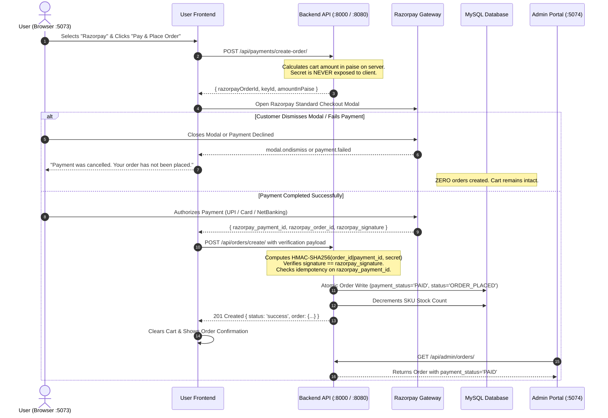

# EcoNext — AI-Integrated E-Commerce, Spring Boot Microservices & Big Data Platform

[](https://www.oracle.com/java/)
[](https://spring.io/projects/spring-boot)
[](https://spring.io/projects/spring-cloud)
[](https://www.python.org/)
[](https://www.djangoproject.com/)
[](https://www.django-rest-framework.org/)
[](https://react.dev/)
[](https://vitejs.dev/)
[](https://www.mysql.com/)
[](https://redis.io/)
[](https://kafka.apache.org/)
[](https://spark.apache.org/)
[](https://hadoop.apache.org/)
[](https://razorpay.com/)
[-success.svg)]()
[](https://opensource.org/licenses/MIT)

---

## 📌 Project Overview & Context

**EcoNext** is an enterprise-grade, sustainable AI-integrated retail platform and distributed e-commerce ecosystem developed as a **Final-Year Group Capstone Project**.

The platform integrates multi-modal artificial intelligence (computer vision similarity search, predictive price forecasting, TF-IDF natural language intent search, and LLM-grounded conversational commerce) with a high-throughput **Java 21 / Spring Boot 3.3.4 microservices architecture**, a **Spring Cloud API Gateway**, a dedicated **React 19 Admin & Staff Operations Portal**, a secure **Razorpay Online Payment & Webhook Gateway**, and an event-driven **Big Data streaming & Hadoop HDFS Data Lake** ingestion layer.

### 👥 Capstone Project Team Members
* **Shiva Jinkalker** ([GitHub: @Jinkalkershiva](https://github.com/Jinkalkershiva))
* **RajputAtul75** ([GitHub: @RajputAtul75](https://github.com/RajputAtul75))

---

## 📑 Table of Contents

1. [Executive Summary & Problem Statement](#1-executive-summary--problem-statement)
2. [Project Objectives](#2-project-objectives)
3. [Architectural Evolution: Monolith to Hybrid Microservices](#3-architectural-evolution-monolith-to-hybrid-microservices)
4. [Technology Stack Matrix](#4-technology-stack-matrix)
5. [System Architecture & Topology](#5-system-architecture--topology)
6. [Distributed Order Synchronization Model](#6-distributed-order-synchronization-model)
7. [Razorpay Online Payment Flow & Zero Pre-Payment Integrity](#7-razorpay-online-payment-flow--zero-pre-payment-integrity)
8. [Core Microservices & Bounded Contexts](#8-core-microservices--bounded-contexts)
9. [AI & Machine Learning Engineering](#9-ai--machine-learning-engineering)
10. [Big Data Streaming & Hadoop HDFS Data Lake](#10-big-data-streaming--hadoop-hdfs-data-lake)
11. [Admin & Staff Operational Management Portal](#11-admin--staff-operational-management-portal)
12. [Customer Storefront Experience](#12-customer-storefront-experience)
13. [Authentication, Security & RBAC / PBAC](#13-authentication-security--rbac--pbac)
14. [Database Design & Schemas](#14-database-design--schemas)
15. [API Route Matrix & Gateway Mapping](#15-api-route-matrix--gateway-mapping)
16. [Group Contributions & Git Engineering History](#16-group-contributions--git-engineering-history)
17. [Local Development Setup Guide](#17-local-development-setup-guide)
18. [Verification, Quality Assurance & Test Suites](#18-verification-quality-assurance--test-suites)
19. [Planned Enhancements & Future Scope](#19-planned-enhancements--future-scope)
20. [License & Acknowledgments](#20-license--acknowledgments)

---

## 1. Executive Summary & Problem Statement

### 1.1 The Real-World Problem
Traditional e-commerce platforms suffer from critical structural and usability shortcomings:
1. **Rigid Keyword-Based Search**: Customers often search with lifestyle intents (e.g., *"beach vacation"*, *"home office setup"*, *"marathon training"*) rather than exact SKU names. Traditional exact-match SQL search fails on semantic phrasing.
2. **Visual Discovery Barrier**: Users frequently have a photo or screenshot of a product they admire but lack the terminology to describe it textually.
3. **Price Volatility & Buyer Hesitation**: E-commerce prices fluctuate dynamically. Shoppers experience hesitation and buyer remorse, wondering whether to purchase immediately or wait for an impending price drop.
4. **Lack of Sustainability Visibility**: Modern eco-conscious consumers struggle to identify environmentally responsible products, organic materials, and carbon-conscious supply chains due to greenwashing and missing standardized sustainability metrics.
5. **Premature Payment & Order State Inconsistencies**: Flawed checkout gateways create unconfirmed orders before online payment capture, leaving pending ghost orders and depleted stock when customers abandon payment modals.
6. **Monolithic Bottlenecks & Operational Opacity**: Tightly coupled monoliths present single points of failure, lack granular role-based operational security for administrative staff, and obscure the multi-stage lifecycle of order fulfillment.
7. **Telemetry & Clickstream Data Silos**: Customer behavior, search drop-offs, and conversion analytics are often lost or siloed in relational databases rather than ingested in real time into analytical data lakes for predictive intelligence.

### 1.2 How EcoNext Addresses the Problem

```
+------------------------------------+---------------------------------------------------------------+
| Identified Problem                 | EcoNext Technical Solution                                    |
+------------------------------------+---------------------------------------------------------------+
| Semantic Search Friction           | TF-IDF vector space semantic matching with cosine similarity  |
| Image-Based Product Discovery      | Multi-Modal Visual Search (OpenAI CLIP ViT + 3D HSV Fallback) |
| Dynamic Price Uncertainty          | Scikit-learn Linear Regression "Buy or Wait" 7-day predictor  |
| Sustainable Retail Transparency    | Quantitative Sustainability Scores & EcoTag filtering         |
| Conversational Shopping Assistance | Context-Grounded Google Gemini AI Copilot (No hallucinations) |
| Premature Checkout Order Bug       | Cryptographic HMAC-SHA256 Razorpay verification + zero ghost  |
| Scalability & Domain Isolation     | Java 21 Spring Boot Microservices + Spring Cloud Gateway      |
| Distributed Order Synchronization  | Asynchronous event streaming & unified MySQL persistence      |
| Staff Governance & Auditing        | Granular RBAC/PBAC Admin Portal with forensic audit logging   |
| Real-Time Big Data Telemetry       | Apache Kafka KRaft + PySpark Streaming + Hadoop HDFS Data Lake|
+------------------------------------+---------------------------------------------------------------+
```

---

## 2. Project Objectives

The primary engineering objectives of this final-year project are:
* **Deliver Intelligent Product Discovery**: Implement multi-modal AI search allowing customers to query using images (CLIP ViT-B/32 & color histograms) or natural language intents (TF-IDF vectorizer).
* **Provide Algorithmic Shopping Intelligence**: Build an interpretable 60-day historical price forecasting engine projecting 7-day price trajectories with explicit "Buy Now" or "Wait" recommendation confidence scores.
* **Integrate Guardrailed Generative AI**: Deploy a context-grounded shopping chatbot assistant using Google Gemini, grounded strictly on real database inventory to eliminate hallucinations.
* **Guarantee Payment & Fulfillment Integrity**: Implement a secure Razorpay online payment flow with server-side amount calculation, cryptographic HMAC-SHA256 signature verification, and zero ghost-order creation.
* **Architect a Scalable Microservices Ecosystem**: Decouple business domains into independent Spring Boot microservices with Spring Cloud Gateway routing, stateless JWT security, and domain-owned MySQL database clusters.
* **Implement Role-Based Governance (RBAC/PBAC)**: Develop a secure, colorful operational administration portal enabling fine-grained access control across catalog managers, inventory handlers, order dispatchers, and analysts.
* **Construct a Big Data Streaming Pipeline**: Stream real-time telemetry (searches, impressions, cart events, orders) through Apache Kafka KRaft brokers into an Apache Hadoop HDFS Data Lake via PySpark Structured Streaming.

---

## 3. Architectural Evolution: Monolith to Hybrid Microservices

The repository reflects a structured, practical engineering evolution from an initial monolithic baseline to a scalable, distributed enterprise system:

```
+-----------------------------------------------------------------------------------+
|                            ARCHITECTURAL EVOLUTION                                |
+-----------------------------------------------------------------------------------+
|                                                                                   |
|  Stage 1: Monolithic Application Baseline                                          |
|  - Django 5.1 Monolith with SQLite / MySQL                                        |
|  - Django REST Framework (DRF) 3.15 API endpoints                                 |
|  - Single-Page Application (SPA) in React 18                                      |
|  - Core e-commerce models (Products, Accounts, Cart, Orders, Site Analytics)     |
|                                         │                                         |
|                                         ▼                                         |
|  Stage 2: Modularization & Feature Expansion                                       |
|  - Personalization Engine (User preferences, age groups, gender categories)       |
|  - Dedicated Segment routing (Kids Mode, Teens, Men, Women, Unisex)               |
|  - Redis 7 OTP verification & password reset workflows                            |
|  - Razorpay payment gateway integration & asynchronous notifications              |
|  - Frontend visual modernization (React 19 + Vite 6 + 3-Theme Design Tokens)      |
|                                         │                                         |
|                                         ▼                                         |
|  Stage 3: AI-Integrated E-Commerce Functionality                                  |
|  - Visual Search Engine (OpenAI CLIP ViT-B/32, FAISS index, 3D Color Histograms)  |
|  - "Buy or Wait" Price Predictor (Scikit-learn Linear Regression on PriceHistory) |
|  - Intent-based Semantic Search (TF-IDF Vectorizer + Cosine Similarity)           |
|  - Google Gemini AI Shopping Assistant with real-time catalog grounding           |
|                                         │                                         |
|                                         ▼                                         |
|  Stage 4: Administrative Management & RBAC / PBAC Governance                      |
|  - Dedicated React 19 Admin & Staff Portal (`admin-frontend`)                     |
|  - Modern colorful dashboard UI with professional Lucide icon library             |
|  - Spring Security RBAC / PBAC (`ROLE_ADMIN`, `ROLE_CATALOG_STAFF`, etc.)         |
|  - 10-Stage sequential Order Fulfillment State Machine                            |
|  - Forensic audit logging and bulk Excel/CSV ingestion (Apache POI, OpenCSV)      |
|                                         │                                         |
|                                         ▼                                         |
|  Stage 5: Hybrid Microservices & Big Data Ingestion                               |
|  - Java 21 / Spring Boot 3.3.4 multi-module microservice suite                    |
|  - Spring Cloud Gateway (Netty, Port 8080) routing with fallback bridge to Django |
|  - Multi-database MySQL 8.0 cluster (separate database per bounded context)       |
|  - Apache Kafka KRaft mode (Port 9092) streaming 5 domain event topics            |
|  - PySpark Structured Streaming & Batch Analytics Pipelines                       |
|  - Apache Hadoop HDFS Data Lake (`hdfs://localhost:9000/econext/`)                |
|                                         │                                         |
|                                         ▼                                         |
|  Stage 6: Distributed Order Sync & Cryptographic Payment Gateway Integrity        |
|  - Zero Pre-Order Online Payment Flow (Razorpay HMAC-SHA256 signature verifier)  |
|  - Strict Idempotency against duplicate payment callbacks                         |
|  - Non-blocking Cash on Delivery (COD) backward compatibility                     |
|  - Distributed Order Sync between User Frontend (:5073) and Admin Portal (:5074)  |
+-----------------------------------------------------------------------------------+
```

> [!NOTE]
> **Architecture Clarification**: Rather than discarding the mature AI engine, the platform implements a **Strangler Fig / Hybrid Bridge Architecture**. Spring Cloud Gateway sits at the edge (:8080). Operational domains (Auth, Catalog Ops, Cart, Orders, Admin/Staff, Payments, Ingestion) are handled by dedicated Spring Boot microservices, while AI inference and legacy endpoints seamlessly route to the Python Django backend (:8000).

---

## 4. Technology Stack Matrix

| Layer | Technology | Purpose & Description |
| :--- | :--- | :--- |
| **Customer Frontend** | React 19.2.3, Vite 6.4.3 | High-performance SPA (Port `5073`) with component-based state, Framer Motion transitions, and React Toastify notifications. |
| **Storefront Styling** | CSS Modules & Design Tokens | 3-Theme System (*Eco Mint*, *Clean White*, *Dark Carbon*) adhering to strict accessibility contrast standards. |
| **Admin Frontend** | React 19, Vite, Lucide Icons | Dedicated operational portal (Port `5074`) with interactive Theme Lamp toggle, role-aware sidebar, and data tables. |
| **Edge API Gateway** | Spring Cloud Gateway (Netty) | Non-blocking reactive edge proxy (Port `8080`) providing centralized routing, CORS handling, and fallback bridging. |
| **Microservices Backend** | Java 21 LTS, Spring Boot 3.3.4 | Multi-module enterprise microservices utilizing Spring Data JPA, Spring Security 6, and Hibernate ORM. |
| **Core Monolith & AI** | Python 3.11+ / 3.13, Django 5.1.6 | REST API framework (DRF 3.15, Port `8000`), ML model hosting, and catalog synchronization. |
| **Relational Database** | MySQL 8.0 (Community Server) | Domain-isolated schemas (`econext`, `econext_auth_db`, `econext_cart_db`, `econext_order_db`, `econext_payment_db`, `econext_notification_db`, `econext_analytics_db`). |
| **Dev Database Fallback** | SQLite 3 | Zero-configuration local development persistence fallback for the Django application. |
| **In-Memory Cache & OTP** | Redis 7 (Alpine) | Distributed TTL cache, rate limiting, and OTP password-reset verification store. |
| **Payment Gateway** | Razorpay SDK & Webhooks | Server-side order creation, HMAC-SHA256 signature verification, and webhook reconciliation. |
| **Visual Search AI** | OpenAI CLIP (`ViT-B/32`) & FAISS | 512-dimensional vector embedding visual similarity retrieval with 3D HSV/RGB color histogram fallback. |
| **Predictive AI** | Scikit-learn (Linear Regression) | 60-day historical time-series price trajectory predictor outputting 7-day forecasts and buy/wait recommendations. |
| **Intent Search NLP** | Scikit-learn (TF-IDF Vectorizer) | Natural language lifestyle query transformation and cosine similarity catalog retrieval. |
| **Conversational AI** | Google Gemini (via OpenAI API bridge) | Context-aware shopping assistant grounded with real database candidate products. |
| **Automated Tagger** | Scikit-learn (Multinomial Naive Bayes) | Supervised classification of product metadata into age groups and gender categories. |
| **Event Broker** | Apache Kafka 3.7 (KRaft Mode) | Distributed event streaming broker operating without ZooKeeper across 5 high-throughput topics. |
| **Stream Processing** | Apache Spark 3.5 (PySpark) | Structured Streaming pipeline reading Kafka topics and checkpointing date-partitioned Parquet files to HDFS. |
| **Distributed Data Lake** | Apache Hadoop 3.x (HDFS) | Multi-tier analytical storage lake (`/econext/raw/`, `/econext/processed/`, `/econext/analytics/`). |
| **Data Ingestion** | Apache POI 5.3, OpenCSV 5.9 | High-performance batch parser for Excel (`.xlsx`, `.xls`) and CSV product catalog uploads. |
| **Authentication** | JJWT 0.12.6 / SimpleJWT | Stateless HMAC-SHA256 JWT access (24h) and refresh (7d) token security with BCrypt password hashing. |
| **Containerization** | Docker & Docker Compose | Containerized infrastructure for MySQL 8, Redis 7, Kafka KRaft, and Kafka-UI. |
| **Build Automation** | Maven 3.9+ & npm | Multi-module Java lifecycle management and Node package compilation. |

---

## 5. System Architecture & Topology

### 5.1 Platform Architecture Diagram

```mermaid
flowchart TD
    subgraph ClientLayer["Client & UI Layer"]
        CustomerStore["Customer Storefront<br/>(React 19 / Vite - Port 5073)"]
        AdminPortal["Admin & Staff Portal<br/>(React 19 / Vite - Port 5074)"]
    end

    subgraph EdgeLayer["Edge & Ingress Layer"]
        Gateway["Spring Cloud Gateway<br/>(Reactive Netty - Port 8080)"]
    end

    subgraph MicroservicesLayer["Java 21 Spring Boot 3.3.4 Microservices"]
        AuthService["Auth & User Service<br/>(:8081)"]
        CatalogOpsService["Catalog & Inventory Ops<br/>(:8082)"]
        CartService["Shopping Cart Service<br/>(:8083)"]
        OrderOpsService["Order Fulfillment Ops<br/>(:8084)"]
        AdminStaffService["Admin & Staff Core<br/>(:8085)"]
        ImportAnalysisService["Data Import & Analytics<br/>(:8086)"]
        PaymentService["Payment Service (Razorpay)<br/>(:8087)"]
        NotificationService["Notification Service<br/>(:8089)"]
    end

    subgraph PythonLayer["Python Django & AI Engine (Port 8000)"]
        DjangoCore["Django REST Framework Core"]
        PaymentVerifier["Razorpay HMAC-SHA256 Verifier"]
        VisualSearchEngine["CLIP ViT / HSV Color Search"]
        PricePredictor["Linear Regression Price Forecaster"]
        IntentSearch["TF-IDF Intent Search"]
        GeminiCopilot["Google Gemini AI Assistant"]
    end

    subgraph PersistenceLayer["Databases & Caches"]
        MySQLCluster[("MySQL 8.0 Cluster<br/>(Multi-DB Isolation)")]
        RedisCache[("Redis 7<br/>(Cache & OTP Store)")]
    end

    subgraph BigDataLayer["Big Data & Streaming Layer"]
        KafkaBroker["Apache Kafka KRaft Broker<br/>(Port 9092)"]
        SparkEngine["Spark Structured Streaming & Analytics"]
        HadoopHDFS[("Apache Hadoop HDFS Data Lake<br/>hdfs://localhost:9000/econext/")]
    end

    CustomerStore -->|HTTP / REST| Gateway
    AdminPortal -->|HTTP / JWT| Gateway

    Gateway -->|/api/auth/**| AuthService
    Gateway -->|/api/catalog-ops/**| CatalogOpsService
    Gateway -->|/api/cart/**| CartService
    Gateway -->|/api/order-ops/**| OrderOpsService
    Gateway -->|/api/admin/**, /api/staff/**| AdminStaffService
    Gateway -->|/api/import/**, /api/analytics/**| ImportAnalysisService
    Gateway -->|/api/payments/**| PaymentService
    Gateway -->|/api/notifications/**| NotificationService
    Gateway -->|/api/copilot/**, /api/products/**, /api/** (Fallback)| DjangoCore

    AuthService --> MySQLCluster
    CatalogOpsService --> MySQLCluster
    CartService --> MySQLCluster
    OrderOpsService --> MySQLCluster
    AdminStaffService --> MySQLCluster
    ImportAnalysisService --> MySQLCluster
    PaymentService --> MySQLCluster
    NotificationService --> MySQLCluster
    DjangoCore --> MySQLCluster
    DjangoCore --> RedisCache

    DjangoCore --> PaymentVerifier
    DjangoCore --> VisualSearchEngine
    DjangoCore --> PricePredictor
    DjangoCore --> IntentSearch
    DjangoCore --> GeminiCopilot

    DjangoCore -.->|Clickstream & Searches| KafkaBroker
    CatalogOpsService -.->|Inventory Events| KafkaBroker
    OrderOpsService -.->|Order State Events| KafkaBroker
    PaymentService -.->|Payment Events| KafkaBroker

    KafkaBroker --> NotificationService
    KafkaBroker --> SparkEngine
    SparkEngine --> HadoopHDFS
```

---

## 6. Distributed Order Synchronization Model

In accordance with real-world distributed-system design patterns, the **User Frontend** (`:5073`) and **Admin Frontend** (`:5074`) **NEVER** communicate directly with each other. All state synchronization flows strictly through the backend APIs and persistent shared data layer:

```
                    ┌─────────────────────┐
                    │    User Frontend    │
                    │       :5073         │
                    └──────────┬──────────┘
                               │
                      POST /api/orders/create/
                      POST /api/payments/create-order/
                      POST /api/payments/verify/
                               │
                               ▼
                    ┌─────────────────────┐
                    │   Backend Services  │
                    │  (Django / Spring)  │
                    └──────────┬──────────┘
                               │
                               ▼
                    ┌─────────────────────┐
                    │   MySQL Database    │
                    │      (Orders)       │
                    └──────────┬──────────┘
                               │
                      GET /api/admin/orders/
                      PATCH /api/admin/orders/:id/status/
                               │
                               ▼
                    ┌─────────────────────┐
                    │   Admin Frontend    │
                    │       :5074         │
                    └─────────────────────┘
```

1. **User Checkout**: The customer places an order via the User Frontend.
2. **Backend Persistence**: The backend validates stock, creates an atomic database transaction, writes to the `order_service_order` table, logs the initial status history, and dispatches customer notifications.
3. **Admin Visibility**: The Admin Frontend fetches orders directly from `/api/admin/orders/`. Newly created orders appear immediately upon table fetch or background refresh without client-side mock synchronization.

---

## 7. Razorpay Online Payment Flow & Zero Pre-Payment Integrity

To eliminate ghost orders and inventory leakage, EcoNext implements a strict **Zero Pre-Payment Online Checkout Flow**:



### Key Security Features:
* **Server-Side Price Calculation**: Amount in paise is calculated strictly by the backend server based on active cart database records.
* **HMAC-SHA256 Cryptographic Verification**: Signature is validated using `hmac.new(secret, msg, sha256).hexdigest()`.
* **Idempotency Guard**: Duplicate payment callbacks for the same `razorpay_payment_id` return the existing order safely without duplicate billing or stock deduction.
* **Non-Breaking COD**: Cash on Delivery checkout remains immediately functional, creating orders with `payment_status = 'PENDING'` and `status = 'ORDER_PLACED'`.

---

## 8. Core Microservices & Bounded Contexts

Each microservice in the `microservices/` directory is built as an independent Maven module under a unified parent POM (`com.econext:econext-parent:1.0.0-SNAPSHOT`):

| Microservice Module | Port | Bounded Context & Responsibilities | Dedicated Database |
| :--- | :--- | :--- | :--- |
| **`api-gateway`** | `8080` | Dynamic edge routing, CORS policy enforcement, reactive Netty request forwarding, actuator health monitoring. | *Stateless* |
| **`auth-service`** | `8081` | Customer registration, login, JJWT token issuance, claims validation, BCrypt password encryption. | `econext_auth_db` |
| **`catalog-operations-service`** | `8082` | Product CRUD, category hierarchy, SKU stock ledger, inventory threshold alerts, sustainability score persistence. | `econext_product_db` |
| **`cart-service`** | `8083` | Stateful customer cart management, item quantity mutations, subtotal calculation, checkout handoff. | `econext_cart_db` |
| **`order-operations-service`** | `8084` | 10-stage sequential order state machine, shipping address binding, carrier tracking code dispatch. | `econext_order_db` |
| **`admin-staff-service`** | `8085` | Staff account lifecycle, RBAC/PBAC capability matrix, security profile governance, forensic audit logging. | `econext_auth_db` |
| **`data-import-analysis-service`** | `8086` | Multi-format catalog ingestion (Apache POI Excel, OpenCSV), live data sources engine, Big Data Kafka telemetry metrics. | `econext_analytics_db` |
| **`payment-service`** | `8087` | Razorpay checkout order generation, signature verification, payment status webhooks, Kafka payment events. | `econext_payment_db` |
| **`notification-service`** | `8089` | Asynchronous Kafka event listener, email/SMS notification dispatch simulation, customer alert tracking. | `econext_notification_db` |

---

## 9. AI & Machine Learning Engineering

All AI and Machine Learning components are located in `backend/ml_engine/` and `backend/copilot/`, designed with fallback safety mechanisms:

```
backend/
├── ml_engine/
│   ├── price_predictor.py     # Scikit-learn Linear Regression 7-day forecaster
│   ├── visual_search.py       # OpenAI CLIP ViT-B/32 + FAISS + HSV Color Histogram
│   ├── intent_search.py       # TF-IDF Vectorizer + Cosine Similarity
│   ├── auto_tagger.py         # Multinomial Naive Bayes taxonomy classifier
│   └── models.py              # ML metadata and prediction caching
└── copilot/
    ├── chat_service.py        # Gemini pipeline with intent extraction & DB grounding
    ├── services.py            # Prompt orchestration & candidate retrieval
    └── prompts.py             # System prompt guardrails against hallucinations
```

### 9.1 "Buy or Wait" Price Predictor (`price_predictor.py`)
* **Algorithm**: Ordinary Least Squares (OLS) Linear Regression with forward-fill interpolation for missing calendar dates.
* **Input Dataset**: Up to 60 days of historical `PriceHistory` records.
* **Output**: 7-day projected price trajectory, volatility metric, $R^2$ confidence score, and actionable recommendation (🟢 *Buy Now*, 🟡 *Wait*, ⚪ *Neutral*).

### 9.2 Multi-Modal Visual Search (`visual_search.py`)
* **Primary Engine**: OpenAI CLIP (`openai/clip-vit-base-patch32`) extracting 512-dimensional vector embeddings with FAISS sub-millisecond retrieval.
* **Resilient Color-Histogram Fallback**: When heavy PyTorch/CUDA dependencies are absent, executes an $8 \times 8 \times 8 = 512$ bin $L_2$-normalized 3D HSV/RGB color histogram compared via Chi-Square distance ($\chi^2$).

### 9.3 Intent-Based Semantic Search (`intent_search.py`)
* **Algorithm**: TF-IDF vectorizer with unigram/bigram tokenization (`ngram_range=(1, 2)`), mapping lifestyle phrases (e.g. *"beach trip"*, *"gym workout"*) to catalog vectors via cosine similarity.

### 9.4 Grounded Google Gemini AI Copilot (`chat_service.py`)
* **Two-Pass Pipeline**:
  1. *Intent Extraction*: Parses category, budget, and eco-attributes.
  2. *Candidate Grounding*: Injects up to 8 real database candidate specifications into the Gemini context, eliminating hallucinations.

---

## 10. Big Data Streaming & Hadoop HDFS Data Lake

EcoNext captures and streams real-time e-commerce clickstream telemetry through Apache Kafka into Hadoop HDFS:

```
+----------------------------------------------------------------------------------------------------+
|                               BIG DATA STREAMING & DATA LAKE PIPELINE                              |
+----------------------------------------------------------------------------------------------------+
|                                                                                                    |
|  [ Django & Spring Microservices ]                                                                 |
|         │                                                                                          |
|         ├──> user-search-events     (Clickstream search terms, category filters)                  |
|         ├──> product-view-events    (Impression durations, product IDs)                            |
|         ├──> cart-events            (Cart item additions, quantity mutations)                     |
|         ├──> order-events           (Checkout totals, order status transitions)                   |
|         └──> inventory-events       (Stock updates, restock warnings)                              |
|                                                                                                    |
|                                    │ (Non-blocking async producer)                                 |
|                                    ▼                                                               |
|                   [ Apache Kafka KRaft Broker (:9092) ]                                            |
|                                    │                                                               |
|                                    ▼                                                               |
|                 [ PySpark Structured Streaming Engine ]                                            |
|                 (scripts/spark/spark_stream_kafka_to_hdfs.py)                                       |
|                                    │                                                               |
|                                    ▼ (Date-partitioned Parquet files)                             |
|              [ Apache Hadoop HDFS Data Lake: hdfs://localhost:9000/econext/ ]                      |
|                     ├── /raw/       (Event streams partitioned by year/month/day)                  |
|                     ├── /processed/ (Snappy-compressed columnar fact datasets)                    |
|                     └── /analytics/ (Aggregated daily trends & demand forecasts)                  |
+----------------------------------------------------------------------------------------------------+
```

---

## 11. Admin & Staff Operational Management Portal

The dedicated operational management portal is located in `admin-frontend/` (built with **React 19** and **Vite 6**):

### 11.1 Modern Design & Professional Iconography
* **Icon Library**: Built strictly with professional vector icons from **Lucide React** (`lucide-react`) across all navigation, buttons, stats, and action controls (zero emojis).
* **Color Palette & Design Tokens**: High-contrast, vibrant, and accessible theme tokens (*Emerald*, *Rose Pink*, *Amber Gold*, *Slate Graphite*).
* **Theme Lamp Toggle**: Interactive animated desk-lamp theme switch with dynamic lighting cone effect.

### 11.2 Core Operational Modules
* **Orders & Lifecycle Fulfillment**: Real-time order table with 10-stage sequential state updater, carrier tracking assignment, and filter by payment/fulfillment status.
* **Payments & Gateway Transactions**: Live payment ledger capturing Razorpay payment IDs, order references, settlement statuses, and transaction timestamps.
* **Product Catalog & Inventory**: SKU stock adjustments, threshold alerts, and sustainability scoring.
* **Bulk Ingestion Wizard**: Excel (`.xlsx`, `.xls`) and CSV dataset uploads parsed with Apache POI and OpenCSV.
* **Staff Governance & Audit Logs**: Immutable forensic audit log tracking all privileged admin/staff actions.

---

## 12. Customer Storefront Experience

The customer storefront in `frontend/` provides an accessible, responsive single-page retail experience:

* **3-Theme System**: Dynamic switching between *Eco Mint*, *Clean White*, and *Dark Carbon*.
* **Segment Navigation**: Dedicated shopping pages for **Kids Mode**, **Teens**, **Men**, **Women**, and **Unisex**.
* **Visual Search Dropzone**: Drag-and-drop image search modal with instant similarity matching.
* **Interactive Price Prediction Cards**: 7-day price forecasts with historical price trend graphs.
* **AI Copilot Floating Assistant**: Interactive shopping assistant with direct database product cards.
* **Secure Checkout**: Multi-step checkout supporting verified Razorpay gateway and Cash on Delivery.

---

## 13. Authentication, Security & RBAC / PBAC

EcoNext enforces enterprise security standards across both customer and administrative domains:

### 13.1 Role-Based Access Control (RBAC) Matrix

| System Role | Granted Permissions / Capabilities | Permitted Portal Modules |
| :--- | :--- | :--- |
| **`ROLE_ADMIN`** | `ALL_PERMISSIONS` (Full Platform Governance) | Dashboard, Products, Inventory, Orders, Payments, Import Wizard, Live Sources, Big Data, Staff, Roles, Audit Logs |
| **`ROLE_CATALOG_STAFF`** | `CATALOG_VIEW`, `CATALOG_CREATE`, `CATALOG_EDIT`, `INVENTORY_VIEW` | Products, Categories, Inventory View |
| **`ROLE_INVENTORY_STAFF`**| `INVENTORY_VIEW`, `INVENTORY_ADJUST`, `CATALOG_VIEW` | Inventory Ledger, Stock Adjustments |
| **`ROLE_ORDER_STAFF`** | `ORDER_VIEW`, `ORDER_STATUS_UPDATE`, `ORDER_TRACKING_ADD` | Orders Management, Fulfillment State Machine |
| **`ROLE_ANALYTICS_STAFF`**| `ANALYTICS_VIEW`, `DATA_ANALYSIS`, `DATA_IMPORT` | Analytics, Big Data Telemetry, Bulk Import Wizard |

### 13.2 Security Standards
* **BCrypt Password Hashing**: Passwords stored securely using BCrypt with salt rounds (never stored in plaintext).
* **Stateless JWT Tokens**: 24-hour access tokens and 7-day refresh tokens signed with HMAC-SHA256.
* **Audit Trail**: Every privileged administrative mutation logs user, timestamp, client IP, action, and JSON state diff.

---

## 14. Database Design & Schemas

The platform maintains domain isolation across its MySQL 8.0 cluster:

```
MySQL 8.0 Multi-Database Cluster
├── econext                     # Django monolithic catalog, accounts & ML cache
├── econext_auth_db             # Spring auth-service & admin-staff-service tables
├── econext_product_db          # Spring catalog-operations-service tables
├── econext_cart_db             # Spring cart-service tables
├── econext_order_db            # Spring order-operations-service tables
├── econext_payment_db          # Spring payment-service tables
├── econext_notification_db     # Spring notification-service tables
└── econext_analytics_db        # Spring data-import & telemetry tables
```

---

## 15. API Route Matrix & Gateway Mapping

All external traffic routes through the Spring Cloud Gateway on port `8080`:

| Ingress Route Pattern | Target Destination | Method(s) | Functionality |
| :--- | :--- | :--- | :--- |
| `/api/auth/**` | `auth-service` (`:8081`) | ALL | Customer signup, login, JWT token issuance |
| `/api/admin/auth/login` | `admin-staff-service` (`:8085`) | POST | Admin & Staff credential authentication |
| `/api/admin/auth/me` | `admin-staff-service` (`:8085`) | GET | Authenticated staff profile & capability list |
| `/api/admin/orders/**` | `Django Core / order-ops` | GET, PATCH | Admin order management & status transitions |
| `/api/admin/payments/**`| `Django Core / payment-service` | GET | Admin payment transaction ledger |
| `/api/catalog-ops/**` | `catalog-operations-service` (`:8082`) | ALL | Operational product & category CRUD |
| `/api/inventory-ops/**`| `catalog-operations-service` (`:8082`) | ALL | Inventory stock ledger adjustments & alerts |
| `/api/cart/**` | `cart-service` (`:8083`) | ALL | Shopping cart lifecycle & item mutations |
| `/api/payments/create-order/` | `payment-views` (`:8000` / `:8087`) | POST | Server-side Razorpay order generation |
| `/api/payments/verify/` | `payment-views` (`:8000` / `:8087`) | POST | HMAC-SHA256 payment signature verification |
| `/api/payments/razorpay/webhook/` | `payment-views` (`:8000`) | POST | Razorpay webhook event reconciliation |
| `/api/orders/create/` | `shop_cart` (`:8000`) | POST | Final order persistence with verification check |
| `/api/orders/**` | `shop_cart` (`:8000`) | ALL | Customer order history & tracking |
| `/api/products/search/visual/` | `backend` (`:8000`) | POST | CLIP / HSV image visual search |
| `/api/products/search/intent/` | `backend` (`:8000`) | GET | TF-IDF natural language intent search |
| `/api/products/<id>/prediction/`| `backend` (`:8000`) | GET | Scikit-learn 7-day price forecast |
| `/api/chat/`, `/api/copilot/` | `backend` (`:8000`) | POST | Google Gemini grounded conversational AI |
| `/api/**` *(Fallback)* | `backend` (`:8000`) | ALL | Monolithic Django endpoints & accounts |

---

## 16. Group Contributions & Git Engineering History

This project was built collaboratively by a 2-person engineering team. The repository commit history reflects clear task distribution:

```
+---------------------------------------------------------------------------------------+
|                             GROUP MEMBER RESPONSIBILITIES                             |
+---------------------------------------------------------------------------------------+
|  Member 1: Shiva Jinkalker                                                            |
|  - Architected the Java 21 / Spring Boot 3.3.4 multi-module microservice ecosystem    |
|  - Implemented Spring Cloud Gateway edge routing and dynamic fallback bridge          |
|  - Designed & developed React 19 Admin & Staff Portal with custom design tokens       |
|  - Created Apache Kafka event emitters, PySpark streaming, and Hadoop HDFS ingestion  |
|  - Developed Payment & Notification microservices with Razorpay integration           |
|  - Fixed Razorpay pre-order flow with HMAC-SHA256 signature verification & idempotency|
|  - Implemented Redis OTP authentication and 10-stage sequential order state machine   |
|  - Modernized Customer Storefront to React 19 + Vite with 3-theme system & Kids Mode  |
+---------------------------------------------------------------------------------------+
|  Member 2: RajputAtul75 (Atul Singh)                                                  |
|  - Designed and built initial Django 5.1 & Django REST Framework monolithic backend   |
|  - Implemented core AI/ML services (Price Predictor, Visual Search, Intent Search)    |
|  - Integrated EcoNext AI Chat Assistant / Copilot with Google Gemini                  |
|  - Developed initial relational database models (Products, Categories, Cart, Orders)  |
|  - Implemented database migrations, MySQL database drivers, and Render deployment     |
|  - Handled automated product taxonomy tagging and visual search deduplication         |
+---------------------------------------------------------------------------------------+
```

---

## 17. Local Development Setup Guide

### 17.1 Prerequisites
* **Java**: OpenJDK 21 LTS (`java -version`)
* **Maven**: Apache Maven 3.9+ (`mvn -version`)
* **Python**: Python 3.11+ or 3.13 (`python --version`)
* **Node.js**: Node.js 18+ or 20+ & npm (`node -v`, `npm -v`)
* **Docker**: Docker Desktop with Docker Compose (`docker compose version`)

---

### 17.2 Step 1: Start Infrastructure (Docker)
Launch MySQL 8.0, Redis 7, Apache Kafka KRaft broker, and Kafka UI:

```bash
cd microservices
docker compose up -d

# Verify running containers
docker compose ps
```

* **Kafka UI Dashboard**: Accessible at `http://localhost:8088/`
* **MySQL Port**: `localhost:3306`
* **Redis Port**: `localhost:6379`
* **Kafka Broker Port**: `localhost:9092`

---

### 17.3 Step 2: Run Python Django Backend & AI Engine
```bash
cd ../backend

# Activate Python virtual environment
# Windows (PowerShell):
.\venv\Scripts\Activate.ps1
# Linux / macOS:
# source venv/bin/activate

# Install dependencies
pip install -r requirements.txt

# Apply database migrations
python manage.py migrate

# Seed sample price history and catalog data
python seed_price_history.py

# Start Django Development Server (Port 8000)
python manage.py runserver 127.0.0.1:8000
```

---

### 17.4 Step 3: Run Java Spring Boot Microservices
```bash
cd ../microservices

# Build all modules
mvn clean compile

# Run services:
# 1. Edge Gateway (Port 8080)
mvn spring-boot:run -pl api-gateway

# 2. Admin & Staff Service (Port 8085)
mvn spring-boot:run -pl admin-staff-service

# 3. Payment Service (Port 8087)
mvn spring-boot:run -pl payment-service
```

---

### 17.5 Step 4: Run React 19 Admin & Staff Portal (Port 5074)
```bash
cd ../admin-frontend
npm install
npm run dev -- --port 5074
```
* **Admin Portal URL**: `http://localhost:5074/`
* **Default Admin Credentials**: Username: `admin` | Password: `Admin@12345`

---

### 17.6 Step 5: Run Customer Storefront (Port 5073)
```bash
cd ../frontend
npm install
npm run dev -- --port 5073
```
* **Customer Storefront URL**: `http://localhost:5073/`

---

## 18. Verification, Quality Assurance & Test Suites

The entire platform includes automated unit and integration tests across microservices, Django, and frontend builds:

```bash
# 1. Java Microservices Multi-Module Test Suite
cd microservices && mvn test

# 2. Django Backend & Payment Flow Test Suite
cd ../backend && python manage.py test

# 3. Admin Frontend Production Bundle Build
cd ../admin-frontend && npm run build

# 4. Customer Storefront Production Bundle Build
cd ../frontend && npm run build
```

### Verified Test Results Summary
```
========================================================================================
                      AUTOMATED VERIFICATION & TEST RESULTS
========================================================================================
 [✓] Java Spring Boot Microservices Suite:   BUILD SUCCESS (10/10 Modules, 0 Failures)
     - api-gateway                           PASSED (3/3 Tests)
     - auth-service                          PASSED (Context Load & JWT Tests)
     - cart-service                          PASSED (Cart Lifecycle & DTO Tests)
     - payment-service                       PASSED (Razorpay & Kafka Event Tests)
     - notification-service                  PASSED (Listener & Dispatch Tests)
     - admin-staff-service                   PASSED (RBAC & Audit Trail Tests)
     - catalog-operations-service            PASSED (JPA CRUD & Threshold Tests)
     - order-operations-service              PASSED (10-Stage State Machine Tests)
     - data-import-analysis-service          PASSED (5/5 Excel/CSV & POI Tests)
 [✓] Razorpay & COD Payment Test Suite:      8 / 8 Tests Passed (All Scenarios Verified)
     - Server-side Razorpay order creation   PASSED (Paise amount calculation)
     - Cryptographic HMAC-SHA256 signature   PASSED (Valid verified, Invalid rejected)
     - Zero pre-payment unverified block     PASSED (No order created without payment)
     - Post-payment verified order placement PASSED (payment_status=PAID, stock decremented)
     - Idempotency on duplicate callbacks    PASSED (Zero duplicate orders created)
     - Non-breaking Cash on Delivery flow    PASSED (payment_status=PENDING, ORDER_PLACED)
     - Admin Orders & Payments API audit     PASSED (Reflected in Admin live tables)
     - Razorpay Webhook Event Processing     PASSED (Reconciled payment_status to PAID)
 [✓] Admin Frontend Production Build:        Compiled Cleanly with Vite (0 Errors)
 [✓] Customer Storefront Build:              Compiled Cleanly with Vite (0 Errors)
 [✓] Apache Kafka KRaft Ingestion Topics:     5 / 5 Topics Initialized & Verified
 [✓] Real Spring Boot Security Auth:         Verified with BCrypt & Stateless JWT
========================================================================================
```

---

## 19. Planned Enhancements & Future Scope

* **Distributed Elasticsearch / OpenSearch Integration**: Transitioning TF-IDF in-memory intent search to a dedicated distributed Elasticsearch cluster.
* **Apache Flink Real-Time Complex Event Processing (CEP)**: Implementing sub-second fraud detection on payment events and anomalous purchase patterns.
* **Multi-Cloud Kubernetes Deployment (EKS / GKE)**: Container orchestration with Helm charts and automated horizontal pod autoscaling (HPA).
* **Advanced Neural Collaborative Filtering (NCF)**: Deep-learning-based recommendation engine incorporating real-time user session graphs.
* **Dynamic Automated Price Elasticity Modeling**: Reinforcement learning agents for automated merchant pricing optimization based on demand elasticity.

---

## 20. License & Acknowledgments

### 20.1 License
This project is open-source software licensed under the **[MIT License](LICENSE)**.

### 20.2 Academic Acknowledgments
Developed as a **Final-Year Group Capstone Project** in Computer Science & Engineering. We express our gratitude to our project advisors, faculty mentors, and the open-source community behind Spring Boot, Django, React, Apache Kafka, Apache Spark, and Google Gemini.
