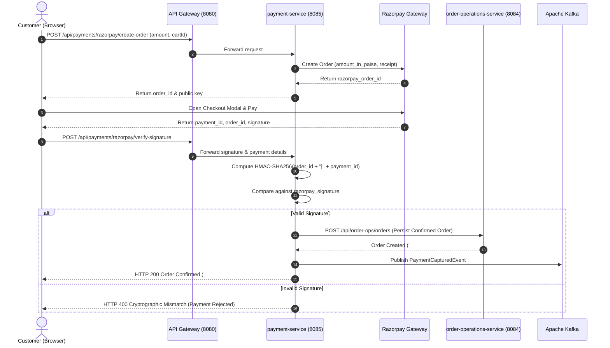
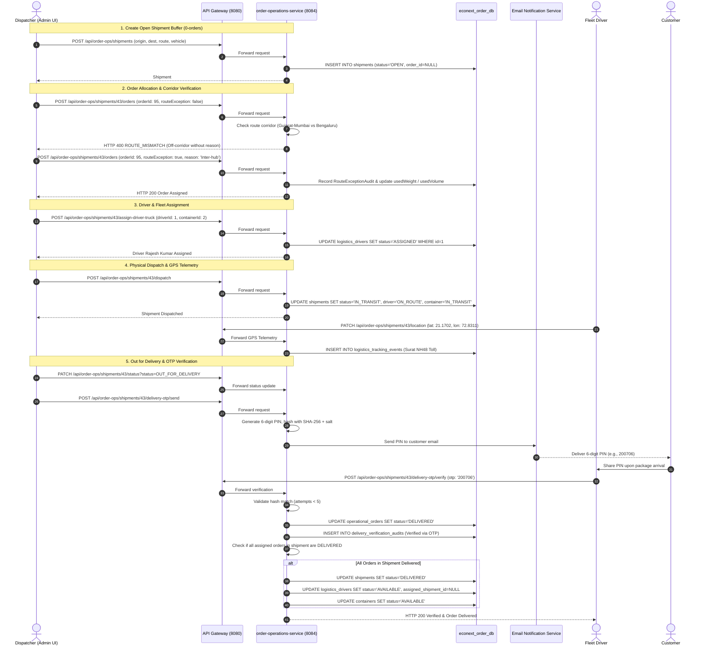

# EcoNext — System Design, Workflows & State Machines

**Document Version**: 2.4.0  
**Scope**: Core Workflows, Visual Diagrams, State Transitions, and Cryptographic Security Models  

---

## 1. Data Flow Diagrams (DFD)

### 1.1 DFD Level 0 — Context Diagram
```
                     ┌───────────────────────┐
                     │   Customer Shopper    │
                     └───────────┬───────────┘
                                 │
     Product Browsing, AI Queries,│ Customer Profile, Orders,
     Cart Mutations, Payment     │ Delivery PIN Verification
                                 ▼
                     ┌───────────────────────┐
                     │                       │
                     │   EcoNext Platform    │
                     │  (Distributed Core)   │
                     │                       │
                     └───────────▲───────────┘
                                 │
     Inventory Ingestion, Fleet  │ Real-time Telemetry,
     Scheduling, Order Allocation│ Exception Overrides, Audits
                                 │
                     ┌───────────┴───────────┐
                     │  Operational Staff    │
                     │  (Admin, Dispatcher)  │
                     └───────────────────────┘
```

---

## 2. Sequence Diagrams

### 2.1 Sequence Diagram: Cryptographic Razorpay Payment & Order Creation


---

### 2.2 Sequence Diagram: Complete Fulfillment, Corridor Audit & OTP Delivery


---

## 3. Operational State Machine Models

### 3.1 Customer Order State Machine
```
[ORDER_PLACED]
      │
      ▼ (Razorpay payment captured)
[ORDER_CONFIRMED]
      │
      ▼ (Warehouse picking & packaging)
[PACKED]
      │
      ▼ (Assigned to shipment buffer)
[ASSIGNED_TO_SHIPMENT]
      │
      ▼ (Vehicle departure)
[IN_TRANSIT]
      │
      ▼ (Final-mile delivery hub reached)
[OUT_FOR_DELIVERY]
      │
      ▼ (Customer 6-digit OTP verified)
[DELIVERED]
```
*(Alternative terminal transitions: `CANCELLED` prior to physical dispatch, or `RETURN_REQUESTED` post-delivery).*

---

### 3.2 Physical Shipment State Machine
```
[OPEN] (Can accept new orders, load buffers)
      │
      ▼ (Capacity reached or dispatcher locks assignment)
[READY_FOR_DISPATCH]
      │
      ▼ (Vehicle departs warehouse hub)
[IN_TRANSIT]
      │
      ▼ (Arrives at final destination city / local dispatch hub)
[OUT_FOR_DELIVERY]
      │
      ▼ (All assigned orders cryptographically verified via OTP)
[DELIVERED] (Driver & Container reset to AVAILABLE)
```

---

### 3.3 Logistics Driver State Machine
```
[AVAILABLE] ──(Assigned to open shipment)──> [ASSIGNED]
     ▲                                            │
     │                                            │ (Shipment dispatched)
     │                                            ▼
     └──(All assigned orders verified DELIVERED)── [ON_ROUTE]
```

---

### 3.4 Truck / Container State Machine
```
[CREATED / AVAILABLE] ──(Shipment dispatched into transit)──> [IN_TRANSIT]
          ▲                                                         │
          │                                                         │
          └───(All assigned shipment packages DELIVERED)────────────┘
```

---

## 4. Cryptographic Delivery OTP Security Architecture

```
                                  6-Digit PIN Generation
                               (SecureRandom: 100000 - 999999)
                                             │
                                             ▼
                               Salted SHA-256 Hashing
                         MessageDigest.getInstance("SHA-256")
                        Salt: "econext-delivery-salt-" + orderId
                                             │
                                             ▼
                              Persistent Cache Storage
                           Redis Key: delivery:otp:{orderId}
                           Fallback: inMemoryOrderOtpStore
                              TTL: 300 Seconds (5 Minutes)
                                             │
                      ┌──────────────────────┴──────────────────────┐
                      ▼                                             ▼
             Customer Notification                          Driver Verification
          Email via SMTP / Template                        POST .../delivery-otp/verify
         Masked: j***s@gmail.com                                  Raw OTP Input
                                                                    │
                                                                    ▼
                                                            Cryptographic Check:
                                                        hash(raw, salt) == storedHash
                                                                    │
                                            ┌───────────────────────┴───────────────────────┐
                                            ▼ (Match)                                       ▼ (Mismatch)
                                    Clear OTP Token                               Increment Attempt Counter
                           Record DeliveryVerificationAudit                        (Max: 5 before lockout)
                               Mark Order DELIVERED                                 Return HTTP 400 Bad OTP
```
