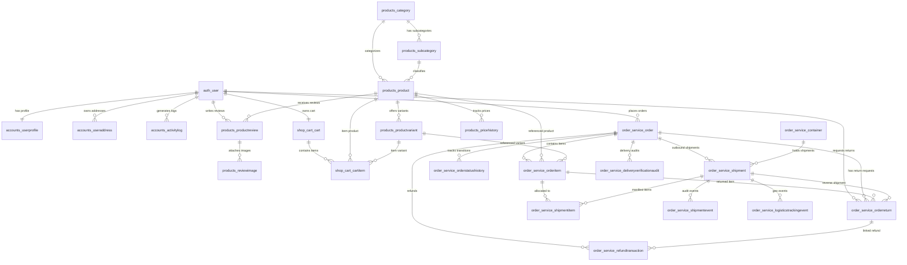
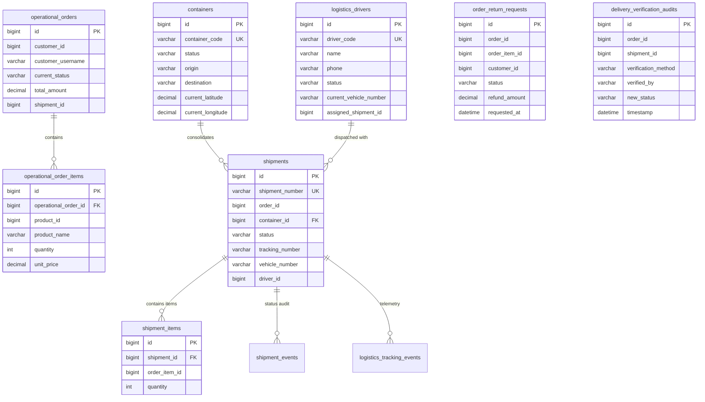
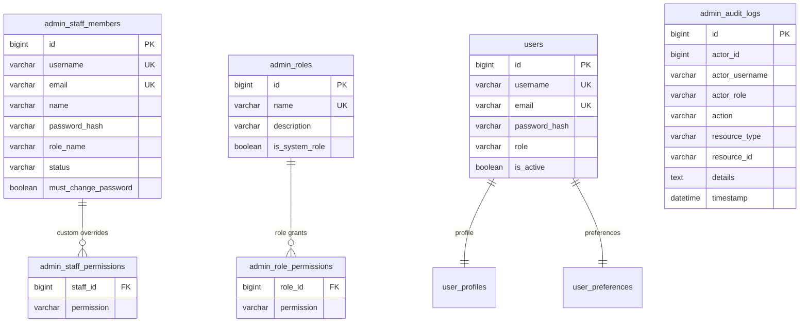

# EcoNext — Database Entity-Relationship (ER) Documentation & Schemas

**Document Version**: 2.0.0  
**Scope**: Multi-Schema Relational Data Model, MySQL 8.0 Physical DDL Mappings, and Logical Cross-Service Boundaries.

---

## 1. Architectural Database Stratification & Separation

EcoNext adheres strictly to the **Database-per-Service** architectural pattern. Relational integrity constraints (foreign keys, cascade rules, unique indexes) are strictly maintained **within** each service's isolated schema.

Cross-service references (such as an order referencing a customer ID, or a shipment referencing a Django order ID) operate as **logical IDs** and are coordinated via REST synchronization or asynchronous Apache Kafka events.

```
┌────────────────────────────────────────────────────────────────────────────────────────┐
│                                MySQL 8.0 Cluster Schemas                               │
├──────────────────────┬──────────────────────┬───────────────────┬──────────────────────┤
│ 1. econext (Django)  │ 2. econext_order_db  │ 3. econext_auth_db│ 4. Other Microservice│
│    • Product Catalog │    • OperationalOrder│    • Staff Members│    Schemas:          │
│    • Orders & Returns│    • Shipments       │    • RBAC Roles   │    • econext_pay_db  │
│    • Shipments & AWB │    • Drivers & Fleet │    • Permissions  │    • econext_cart_db │
│    • Refunds Ledger  │    • Telemetry Events│    • Audit Logs   │    • econext_notif_db│
└──────────────────────┴──────────────────────┴───────────────────┴──────────────────────┘
```

---

## 2. Core Monolithic Schema: `econext` (Django 5.1)

The `econext` schema serves as the primary system of record for product taxonomy, pricing history, transactional orders, reverse logistics, and customer profiles.

### 2.1 Schema Entity-Relationship Diagram (Physical Foreign Keys)



### 2.2 Table Definitions & Core Attributes (`econext`)

| Table Name | Primary Key | Key Foreign Keys | Key Attributes & Constraints |
| :--- | :--- | :--- | :--- |
| `auth_user` | `id` | None | `username` (UQ), `email` (UQ), `password`, `is_staff`, `is_superuser` |
| `accounts_userprofile` | `id` | `user_id` $\rightarrow$ `auth_user.id` (1:1) | `phone`, `address`, `city`, `preferences` (JSON) |
| `accounts_useraddress` | `id` | `user_id` $\rightarrow$ `auth_user.id` | `full_name`, `address_line`, `city`, `zipcode`, `is_default` |
| `products_category` | `id` | None | `name` (UQ), `description` |
| `products_subcategory`| `id` | `category_id` $\rightarrow$ `products_category.id` | `name` |
| `products_product` | `id` | `category_id`, `subcategory_id` | `name`, `current_price`, `stock`, `tags` (JSON), `status`, `return_eligible` |
| `products_productvariant` | `id` | `product_id` $\rightarrow$ `products_product.id` | `size`, `color`, `sku`, `price`, `stock`, `is_active` |
| `order_service_order` | `id` | `user_id` $\rightarrow$ `auth_user.id` | `order_number` (UQ), `status`, `total_amount`, `payment_method`, `tracking_number` |
| `order_service_orderitem` | `id` | `order_id`, `product_id`, `variant_id` | `quantity`, `price_at_purchase`, `weight_kg`, `return_eligible` |
| `order_service_orderreturn`| `id` | `order_id`, `order_item_id`, `user_id` | `status`, `carrier_name`, `tracking_number`, `pickup_scheduled_at`, `inspection_passed` |
| `order_service_shipment` | `id` | `order_id`, `container_id` | `shipment_number` (UQ), `status`, `vehicle_number`, `carrier_name`, `tracking_number` |
| `order_service_shipmentitem`| `id` | `shipment_id`, `order_item_id` | `quantity` |
| `refund_transactions` | `id` | `order_id`, `order_return_id`, `user_id` | `refund_id` (UQ), `amount`, `status`, `idempotency_key` (UQ), `provider_refund_id` |

---

## 3. Operations & Logistics Schema: `econext_order_db` (Spring Boot 8084)

The `order-operations-service` maintains the state machine for operational warehouse fulfillment, container sorting, vehicle telemetry, driver assignments, and delivery verification audits.

### 3.1 Schema Entity-Relationship Diagram



---

## 4. Administrative & Governance Schema: `econext_auth_db` (Spring Boot 8085 / 8081)

The `admin-staff-service` manages operational governance, departmental role assignments, and immutable audit logs. The `auth-service` manages customer JWT authentication.

### 4.1 Schema Entity-Relationship Diagram



---

## 5. Other Bounded Context Schemas

### 5.1 `econext_payment_db` (`payment-service` Port 8087)
* **`payment_transactions`**: `id` (PK), `order_id` (Logical FK), `user_id`, `razorpay_order_id`, `razorpay_payment_id`, `amount`, `status` (`CREATED`, `SUCCESS`, `FAILED`), `payment_method`.
* **`refund_transactions`**: `id` (PK), `refund_id` (UK), `order_id` (Logical FK), `payment_id`, `amount`, `status` (`PENDING`, `SUCCESS`, `FAILED`), `idempotency_key` (UK).

### 5.2 `econext_cart_db` (`cart-service` Port 8083)
* **`carts`**: `id` (PK), `user_id` (UK, Logical FK), `created_at`, `updated_at`.
* **`cart_items`**: `id` (PK), `cart_id` (FK $\rightarrow$ `carts.id`), `product_id` (Logical FK), `quantity`, `unit_price`, `added_at`.

### 5.3 `econext_notification_db` (`notification-service` Port 8089)
* **`notifications`**: `id` (PK), `user_id` (Logical FK), `type`, `title`, `message`, `reference_id`, `is_read`, `created_at`.

### 5.4 `econext_analytics_db` (`data-import-analysis-service` Port 8086)
* **`operational_import_jobs`**: `id` (PK), `filename`, `file_type`, `total_records`, `valid_records`, `imported_records`, `failed_records`, `status`, `staff_username`.

---

## 6. Logical Cross-Service Boundaries & Foreign Keys

To prevent monolithic lock-in and enable zero-downtime microservice horizontal scaling, cross-schema foreign keys are handled at the application layer:

| Source Entity / Schema | Target Entity / Schema | Logical Key | Mechanism / Protocol |
| :--- | :--- | :--- | :--- |
| `operational_orders.customer_id` | `econext.auth_user.id` | `customer_id` | JWT Claim propagation (`sub`) |
| `operational_orders.order_id` | `econext.order_service_order.id` | `order_id` | REST Fetch (`DjangoOrderSyncService`) |
| `payment_transactions.order_id` | `econext.order_service_order.id` | `order_id` | REST Verify / Kafka Event |
| `carts.user_id` | `econext.auth_user.id` | `user_id` | JWT Claim (`sub`) |
| `notifications.user_id` | `econext.auth_user.id` | `user_id` | Kafka Notification Payload |
| `admin_audit_logs.actor_id` | `admin_staff_members.id` | `actor_id` | Spring Security Principal |
